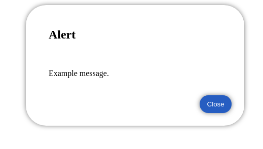

# simaalert
Use simaAlert for replace default alert in Javascript, to beatiful alert.

# How to add?
Download repository and copy
- simaalert.css
- simaalert.js
to your project, then add next code in
index.html
```html
<body>
<script src="alertsima.js"></script>
<!-- Here you body--> 

</body>
```
# How to use?
You can use simaalert as default.
Javascript:
```javascript
alert('Alert text');
```
but simaalert don't support confirm() and prompt()
